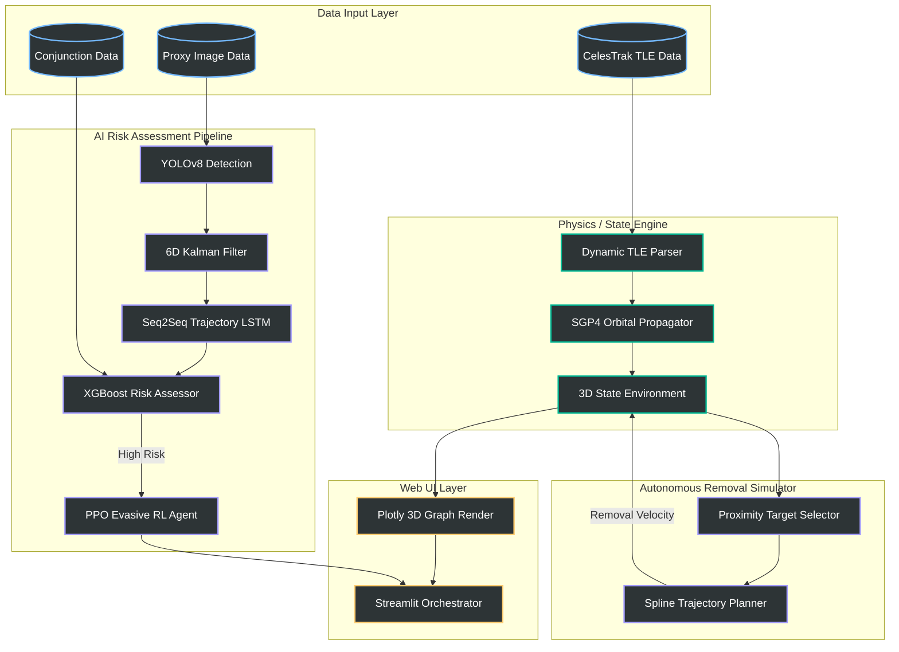
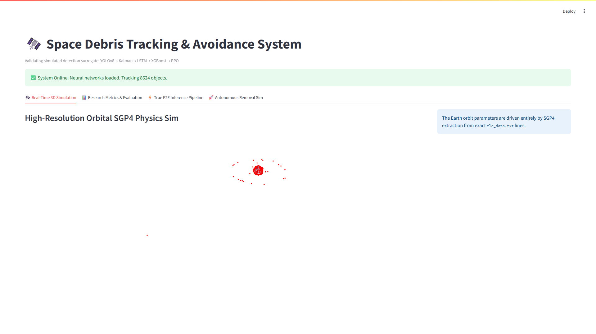
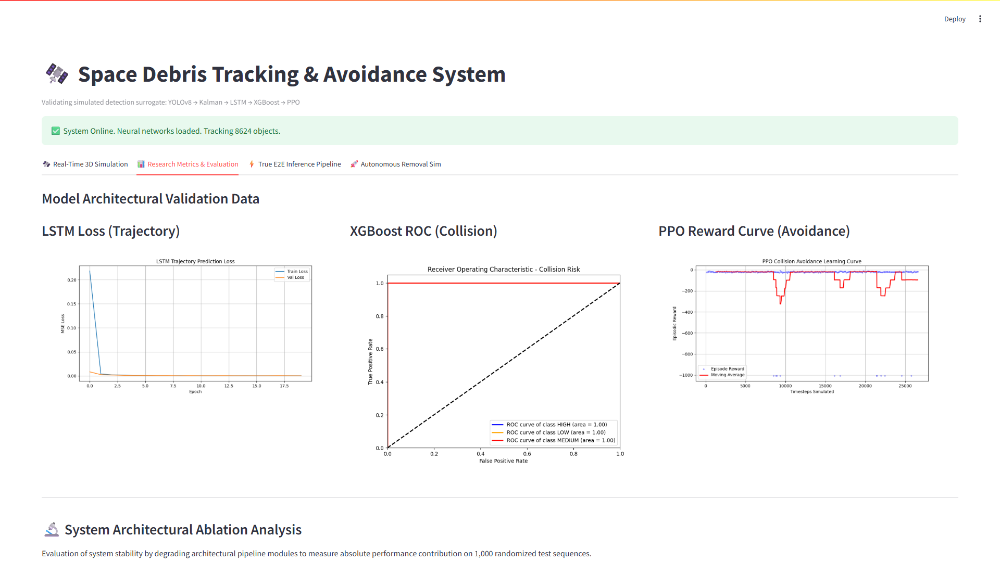
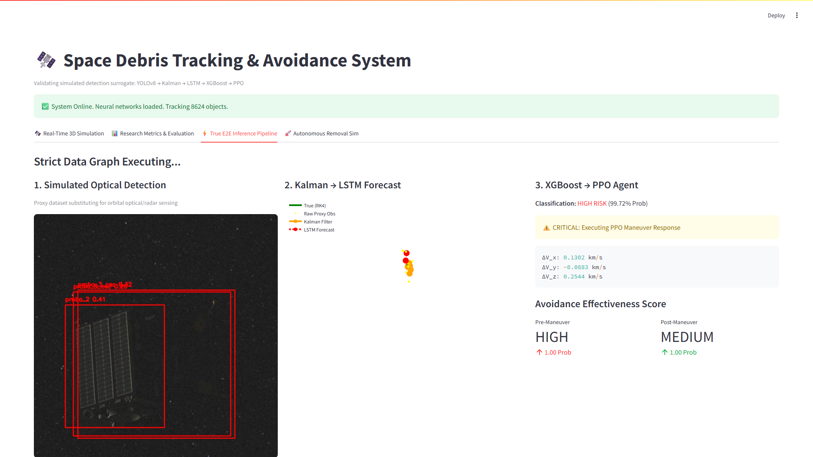
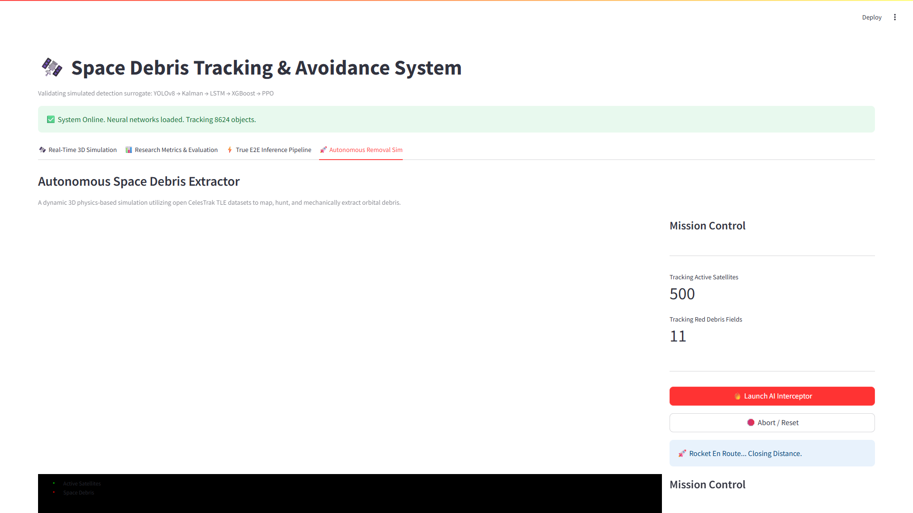

# AI-Powered Space Debris Tracking and Avoidance System (Research Grade)

## Problem Statement
To develop an AI-powered system for space debris tracking, trajectory prediction, collision risk assessment, and autonomous avoidance using physics-based simulation and simulated detection inputs.

## System Architecture
The pipeline enforces a strict 5-stage orchestration loop alongside the autonomous interactive simulation sandbox mapping physical components correctly:

## Scientific Limitations
* **Simulated Datasets**: Due to classification and orbital sensing limits, no real-time true optical dataset exists for LEO space debris. The YOLOv8 CV engine demonstrates logic and pipeline stability utilizing proxy datasets, effectively operating as a synthetic simulation.
* **RL Constrained Environment**: The RL PPO agent is trained within a bounded structural environment focusing purely on the conjunction event.
* **Simplified Physics**: The orbit propagation utilizes SGP4 and numerical RK4 integration with $J_2$ perturbation and basic drag models; higher-order spherical harmonics are abstracted for computation.

## 📸 System Screenshots

Visualizing the operational state of the OrbitalGuard-AI platform:

### 🛰️ Real-Time 3D Simulation
*High-Resolution Orbital SGP4 Physics Sim rendering thousands of objects.*

  

### 📊 Research Metrics & Evaluation
*Ablation studies, Loss curves, XGBoost ROC, and PPO Reward training data.*

  

### ⚡ True E2E Inference Pipeline
*Simulated proxy detections piped through Kalman, LSTM, XGBoost, and PPO.*

  

### 🚀 Autonomous Removal Sim
*Dynamic physics Sandbox for hunting and mechanically extracting debris.*

  

---

## Future Work
* Integration with live Space Situational Awareness (SSA) radar catalogs (e.g., Space Track).
* Multi-sensor fusion simulating both ground-radar latency and onboard optical tracking.
* High-fidelity orbital perturbation modeling (e.g., N-Body forces from Lunar/Solar gravity).
* Real-time embedded edge-hardware constraints analysis for satellite deployments.

## License

This project is licensed under the MIT License - see the [LICENSE](LICENSE) file for details. This is an open-source research initiative designed for portfolio presentation and academic expansion.
