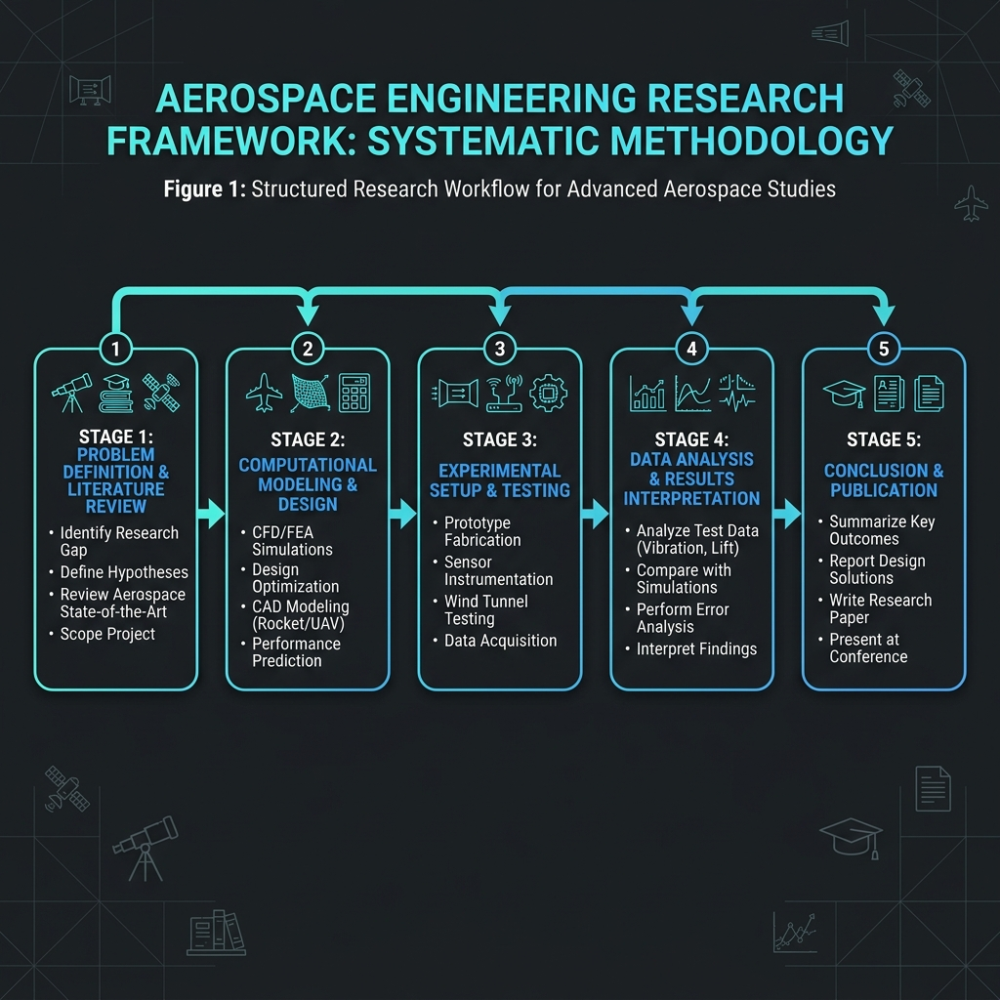
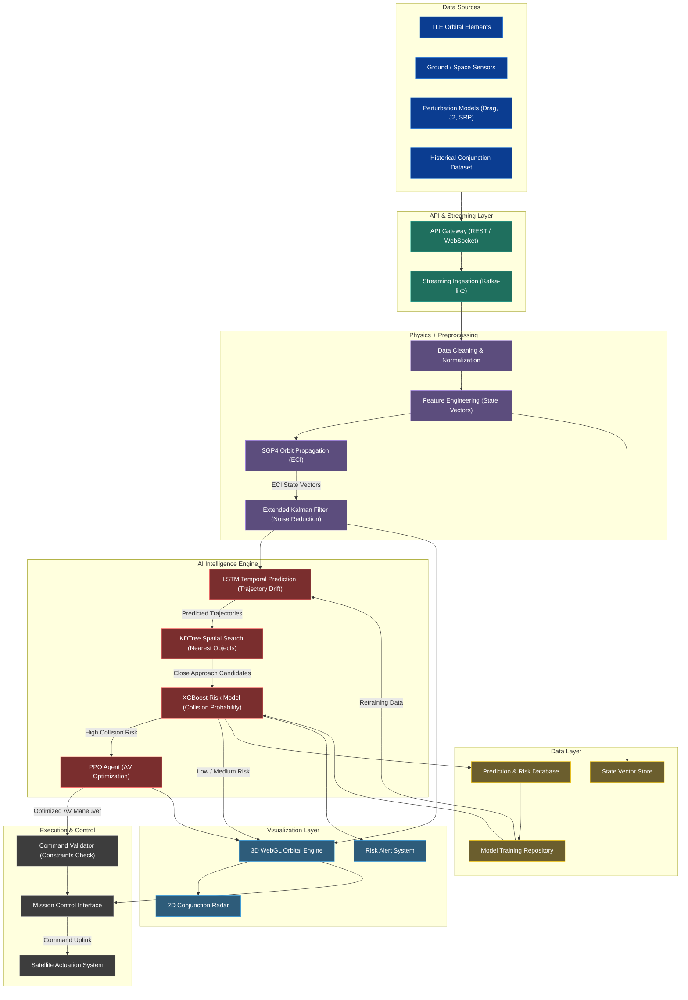

<div align="center">

```
 ██████╗ ██████╗ ██████╗ ██╗████████╗ █████╗ ██╗      ██████╗ ██╗   ██╗ █████╗ ██████╗ ██████╗
██╔═══██╗██╔══██╗██╔══██╗██║╚══██╔══╝██╔══██╗██║     ██╔════╝ ██║   ██║██╔══██╗██╔══██╗██╔══██╗
██║   ██║██████╔╝██████╔╝██║   ██║   ███████║██║     ██║  ███╗██║   ██║███████║██████╔╝██║  ██║
██║   ██║██╔══██╗██╔══██╗██║   ██║   ██╔══██║██║     ██║   ██║██║   ██║██╔══██║██╔══██╗██║  ██║
╚██████╔╝██║  ██║██████╔╝██║   ██║   ██║  ██║███████╗╚██████╔╝╚██████╔╝██║  ██║██║  ██║██████╔╝
 ╚═════╝ ╚═╝  ╚═╝╚═════╝ ╚═╝   ╚═╝   ╚═╝  ╚═╝╚══════╝ ╚═════╝  ╚═════╝ ╚═╝  ╚═╝╚═╝  ╚═╝╚═════╝
```



### 🛰️ &nbsp; *Defending Low Earth Orbit with Physics-Informed AI* &nbsp; 🛰️

<br/>

[](https://python.org)
[](https://nodejs.org)
[](https://reactjs.org)
[](https://fastapi.tiangolo.com)
[](https://threejs.org)
[](https://pytorch.org)
[](https://xgboost.readthedocs.io)
[](LICENSE)


<br/>

> *"A single 1cm bolt travelling at 7 km/s carries the kinetic energy of a hand grenade."*
> — NASA Orbital Debris Program Office

<br/>

**OrbitalGuard AI** is a full-stack, physics-informed AI system for real-time detection, tracking,
risk classification, and autonomous collision avoidance of sub-10cm orbital debris —
the most dangerous and least-tracked threat class in Low Earth Orbit.

<br/>

[](https://www.spaceappschallenge.org)
[]()
[]()

</div>

<br/>

---

<div align="center">

## 📌 &nbsp; Navigation

[🌍 The Problem](#-the-problem) &nbsp;·&nbsp;
[✨ Features](#-core-features) &nbsp;·&nbsp;
[🏗️ Architecture](#️-system-architecture) &nbsp;·&nbsp;
[🔄 Workflow](#-end-to-end-workflow) &nbsp;·&nbsp;
[🗂️ Structure](#️-folder-structure) &nbsp;·&nbsp;
[⚡ Quick Start](#-quick-start) &nbsp;·&nbsp;
[🔬 Tech Stack](#-tech-stack)

</div>

---

<br/>

## 🌍 &nbsp; The Problem

<div align="center">

*The orbital debris crisis is invisible, silent, and accelerating.*

</div>

<br/>

Decades of space launches have turned Low Earth Orbit into a **high-speed debris field**. Fragments from rocket bodies, defunct satellites, and collision events now travel at velocities that make even microscopic particles lethal to active spacecraft.

<br/>

<div align="center">

| &nbsp; | Threat | Scale |
|:---:|:---|:---|
| 🔴 | Untracked debris fragments in LEO | **Millions** |
| 🟠 | Average fragment collision velocity | **7 – 8 km/s** |
| 🟡 | Minimum size trackable by ground radar | **~10 cm** |
| 🔵 | Fragments below radar threshold | **Tens of millions** |
| 🟢 | OrbitalGuard AI detection target | **< 1 mm** |

</div>

<br/>

> 💡 **The Gap:** Ground-based radar tracks objects ≥ 10 cm. Objects between **1 mm and 10 cm** — the most numerous debris class — are essentially invisible to current monitoring systems. OrbitalGuard AI is designed to close this gap entirely.

<br/>

---

<br/>

## ✨ &nbsp; Core Features

<br/>

### &nbsp; 🔭 &nbsp; Phase 1 · Detect &nbsp; `Physics + Vision Simulation`

<div align="center">

| Component | Technology | What It Does |
|:---|:---:|:---|
| **Orbital Propagation** | SGP4 | Converts raw TLE data into precise 6D state vectors (position + velocity) |
| **Debris Detection** | YOLOv8 | Simulates sub-10cm object detection with realistic sensor noise injection |

</div>

<br/>

### &nbsp; 📡 &nbsp; Phase 2 · Track & Predict &nbsp; `ML Operations`

<div align="center">

| Component | Technology | What It Does |
|:---|:---:|:---|
| **State Estimation** | Kalman Filter | Smooths noisy real-time detections into stable trajectory estimates |
| **Trajectory Forecasting** | PyTorch LSTM | Predicts future orbital positions over configurable time horizons |

</div>

<br/>

### &nbsp; 🚀 &nbsp; Phase 3 · Remediate &nbsp; `Collision Avoidance`

<div align="center">

| Component | Technology | What It Does |
|:---|:---:|:---|
| **Proximity Search** | SciPy KDTree | Sub-second conjunction detection across **1,500+** simultaneous objects |
| **Risk Classification** | XGBoost | Tiers conjunctions as 🔴 HIGH / 🟡 MEDIUM / 🟢 LOW with explainable features |
| **ΔV Planning** | PPO (RL) | Computes fuel-optimal avoidance maneuvers via reinforcement learning |

</div>

<br/>

---

<br/>

## 🏗️ &nbsp; System Architecture

<div align="center">

*A modern, decoupled **3-tier real-time streaming pipeline** — AI engine to 3D dashboard.*

</div>

<br/>


```mermaid
flowchart TB

%% =========================
%% STYLES
%% =========================
classDef data fill:#0b3d91,color:#fff,stroke:#1c6ed5
classDef api fill:#1f6f5e,color:#fff,stroke:#2bbbad
classDef proc fill:#5c4d7d,color:#fff,stroke:#9b7ede
classDef ai fill:#7a2e2e,color:#fff,stroke:#ff6b6b
classDef db fill:#6b5e2e,color:#fff,stroke:#f1c40f
classDef ui fill:#2e5c7a,color:#fff,stroke:#3498db
classDef exec fill:#3d3d3d,color:#fff,stroke:#aaaaaa

%% =========================
%% DATA SOURCES
%% =========================
subgraph DATA["Data Sources"]
    direction LR
    TLE["TLE Orbital Elements"]
    SENSOR["Ground / Space Sensors"]
    PERT["Perturbation Models (Drag, J2, SRP)"]
    HIST["Historical Conjunction Dataset"]
end
class TLE,SENSOR,PERT,HIST data

%% =========================
%% INGESTION LAYER
%% =========================
subgraph API["API & Streaming Layer"]
    GW["API Gateway (REST / WebSocket)"]
    ING["Streaming Ingestion (Kafka-like)"]
end
class GW,ING api

%% =========================
%% PREPROCESSING
%% =========================
subgraph PROC["Physics + Preprocessing"]
    CLEAN["Data Cleaning & Normalization"]
    FEAT["Feature Engineering (State Vectors)"]
    SGP4["SGP4 Orbit Propagation (ECI)"]
    EKF["Extended Kalman Filter (Noise Reduction)"]
end
class CLEAN,FEAT,SGP4,EKF proc

%% =========================
%% AI PIPELINE
%% =========================
subgraph AI["AI Intelligence Engine"]
    direction LR
    LSTM["LSTM Temporal Prediction (Trajectory Drift)"]
    KD["KDTree Spatial Search (Nearest Objects)"]
    XGB["XGBoost Risk Model (Collision Probability)"]
    RL["PPO Agent (ΔV Optimization)"]
end
class LSTM,KD,XGB,RL ai

%% =========================
%% STORAGE
%% =========================
subgraph DB["Data Layer"]
    DB1["State Vector Store"]
    DB2["Prediction & Risk Database"]
    DB3["Model Training Repository"]
end
class DB1,DB2,DB3 db

%% =========================
%% VISUALIZATION
%% =========================
subgraph UI["Visualization Layer"]
    DASH["3D WebGL Orbital Engine"]
    RADAR["2D Conjunction Radar"]
    ALERT["Risk Alert System"]
end
class DASH,RADAR,ALERT ui

%% =========================
%% EXECUTION
%% =========================
subgraph EXEC["Execution & Control"]
    CTRL["Mission Control Interface"]
    VALID["Command Validator (Constraints Check)"]
    SAT["Satellite Actuation System"]
end
class CTRL,VALID,SAT exec

%% =========================
%% DATA FLOW
%% =========================

%% Input
DATA --> GW
GW --> ING

%% Preprocessing
ING --> CLEAN
CLEAN --> FEAT
FEAT --> SGP4
SGP4 -->|ECI State Vectors| EKF

%% AI Flow
EKF --> LSTM
LSTM -->|Predicted Trajectories| KD
KD -->|Close Approach Candidates| XGB

%% Decision Branch
XGB -->|High Collision Risk| RL
XGB -->|Low / Medium Risk| DASH

%% RL Path
RL -->|Optimized ΔV Maneuver| VALID
VALID --> CTRL
CTRL -->|Command Uplink| SAT

%% Storage Links
FEAT --> DB1
XGB --> DB2
DB2 --> DB3

%% Visualization Links
EKF --> DASH
XGB --> ALERT
RL --> DASH
DASH --> RADAR

%% Control Feedback
DASH --> CTRL

%% ML Feedback Loop
DB3 -->|Retraining Data| LSTM
DB3 --> XGB
```

<br/>

---

<br/>

## 🧠 &nbsp; ML Pipeline at a Glance

<br/>

```
  ┌─────────────┐
  │  TLE  Data  │  ← Two-Line Element sets (NORAD / Space-Track)
  └──────┬──────┘
         │  SGP4 propagation
         ▼
  ┌─────────────────────┐
  │  YOLO v8 Detection  │  ← Sub-10cm debris with sensor noise simulation
  └──────────┬──────────┘
             │  Bounding boxes + confidence scores
             ▼
  ┌────────────────────────┐
  │  Kalman Filter Tracker  │  ← Extended Kalman Filter (EKF) smoothing
  └────────────┬────────────┘
               │  Stable trajectory sequences
               ▼
  ┌─────────────────────┐
  │  LSTM  Forecaster   │  ← N-step future position prediction
  └──────────┬──────────┘
             │  Predicted state vectors
             ▼
  ┌──────────────────────────┐
  │  KDTree Conjunction Search│  ← Sub-second proximity queries
  └─────────────┬────────────┘
                │  Conjunction candidates
                ▼
  ┌─────────────────────────┐
  │  XGBoost Risk Classifier │
  └──────┬──────┬──────┬────┘
         │      │      │
         ▼      ▼      ▼
      🔴 HIGH  🟡 MED  🟢 LOW
         │
         ▼
  ┌─────────────────┐
  │  PPO RL  Agent  │  ← Stable-Baselines3 · fuel-optimal ΔV
  └────────┬────────┘
           │  Avoidance trajectory
           ▼
  ┌──────────────────────┐
  │  Satellite  Command  │  ← Uplinked via mission control interface
  └──────────────────────┘
```

<br/>

---

<br/>

## 📊 &nbsp; Risk Classification Tiers

<br/>

<div align="center">

| Tier | Probability of Collision | Miss Distance | Automated Response |
|:---:|:---|:---:|:---|
| 🔴 &nbsp; **HIGH** | > 1 in 1,000 | < 1 km | PPO maneuver computed + 🚨 immediate alert issued |
| 🟡 &nbsp; **MEDIUM** | 1 in 1,000 – 10,000 | 1 – 5 km | Added to watchlist + 📋 advisory dispatched |
| 🟢 &nbsp; **LOW** | < 1 in 10,000 | > 5 km | Passive monitoring continues |

</div>

<br/>

---

<br/>

## 🗂️ &nbsp; Folder Structure

<br/>

```

orbitalguard/
│
├── 🐍  backend/                   # Python · FastAPI · AI Engine
│   ├── app/
│   │   ├── main.py                #  Entrypoint + WebSocket broadcaster
│   │   ├── sgp4_engine.py         #  Orbital propagation  (TLE → state vectors)
│   │   ├── yolo_sim.py            #  YOLO debris detection simulation
│   │   ├── kalman.py              #  Extended Kalman Filter tracker
│   │   ├── lstm_model.py          #  Trajectory prediction model
│   │   ├── kdtree.py              #  KDTree conjunction queries
│   │   ├── xgboost_risk.py        #  Risk classification pipeline
│   │   └── ppo_agent.py           #  PPO reinforcement learning agent
│   └── requirements.txt
│
├── ⚛️   frontend/                  # React 18 · Three.js · Vite
│   ├── src/
│   │   ├── components/
│   │   │   ├── Globe3D.tsx         #  Three.js 3D orbital visualization
│   │   │   ├── RiskTable.tsx       #  Real-time conjunction event table
│   │   │   └── ManeuverOverlay.tsx #  ΔV avoidance trajectory renderer
│   │   └── App.tsx
│   └── package.json
│
├── 🟩  server/                    # Node.js WebSocket Proxy
│   ├── index.js                   #  Connection multiplexing + state caching
│   └── package.json
│
├── 📦  dataset/                   # JSON risk event exports
├── 🧠  models/                    # PyTorch (.pt) & XGBoost (.ubj) weights
├── 📂  data/                      # TLE datasets · sensor configs
└── 📄  docs/                      # Research reports · architecture diagrams
```

<br/>


---

<br/>

## ⚡ &nbsp; Quick Start

<div align="center">

> **Prerequisites** &nbsp;·&nbsp;  &nbsp;  &nbsp; 

</div>

<br/>

### &nbsp; `Step 1` &nbsp; — &nbsp; Start the AI Engine
```bash
cd backend
pip install -r requirements.txt
python app/main.py
```

> 🤖 &nbsp; AI engine live at **`http://localhost:8000`** · WebSocket at **`ws://localhost:8000/ws`**

<br/>

### &nbsp; `Step 2` &nbsp; — &nbsp; Start the Proxy Server

```bash
cd frontend/server
npm install
node index.js
```

> 🔀 &nbsp; Proxy handling connection multiplexing on **`port 3001`**

<br/>

### &nbsp; `Step 3` &nbsp; — &nbsp; Launch the Mission Dashboard

```bash
cd frontend/client
npm install
npm run dev
```

        The visualization dashboard will open at `http://localhost:5173`. Make sure to read the generated `report.md` file in the root directory for extensive academic metrics, performance charts, and XGBoost Risk architectures!
> 🌐 &nbsp; 3D Mission Dashboard live at **`http://localhost:5173`**

<br/>

---

<br/>

## 🔬 &nbsp; Tech Stack

<br/>

<div align="center">

| Layer | Technology | Role |
|:---|:---:|:---|
| 🪐 **Orbital Mechanics** | `python-sgp4` | TLE → precise 6D state vector propagation |
| 🔍 **Object Detection** | YOLOv8 | Sub-10cm debris detection with noise simulation |
| 📊 **State Tracking** | Kalman Filter / DeepSORT | Multi-object real-time state estimation |
| 🧠 **Trajectory Prediction** | PyTorch LSTM | N-step future orbital position forecasting |
| ⚡ **Collision Search** | SciPy KDTree | Sub-second proximity queries at scale |
| ⚖️ **Risk Classification** | XGBoost | Explainable conjunction risk tiering |
| 🤖 **Avoidance Planning** | Stable-Baselines3 PPO | Fuel-optimal ΔV maneuver computation |
| 🌐 **Backend API** | FastAPI + WebSockets | Async real-time AI inference engine |
| 🔀 **Proxy Layer** | Node.js | WebSocket multiplexing + state caching |
| 🖥️ **Visualization** | React 18 + Three.js | 3D globe · 60 FPS · 1,500+ objects |
| 📦 **Data Export** | JSON Schema | Conjunction event dataset logging |

</div>

<br/>

---

<br/>

<div align="center">

```
  ✦  ·  ·  ·  ·  ·  ·  ·  ✦  ·  ·  ·  ·  ·  ·  ·  ✦  ·  ·  ·  ·  ·  ·  ·  ✦
          Protecting the orbital commons — one conjunction at a time.
  ✦  ·  ·  ·  ·  ·  ·  ·  ✦  ·  ·  ·  ·  ·  ·  ·  ✦  ·  ·  ·  ·  ·  ·  ·  ✦
```

<br/>

[](https://www.spaceappschallenge.org)

*Built with ❤️ for the orbital debris challenge · MIT Licensed*

</div>
