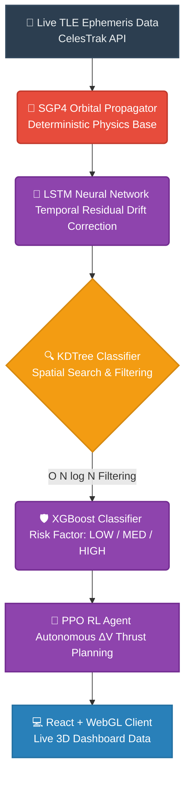

# OrbitalGuard AI - System Architecture

Here is the visual pipeline flow diagram requested for your presentation. You can screenshot this or embed the Mermaid code directly into your slide deck tooling.

### Presentation Talking Points
- **Blue (Data):** System automatically fetches and caches live updates.
- **Red (Physics):** The `SGP4` algorithm computes the mathematical standard trajectory.
- **Purple (AI/ML):** `LSTM` corrects the mathematical error. `XGBoost` categorizes the risk. `PPO` executes collision avoidance.
- **Orange (Filter):** The `KDTree` ensures the entire pipeline happens in real-time by discarding irrelevant distances to save compute power.
